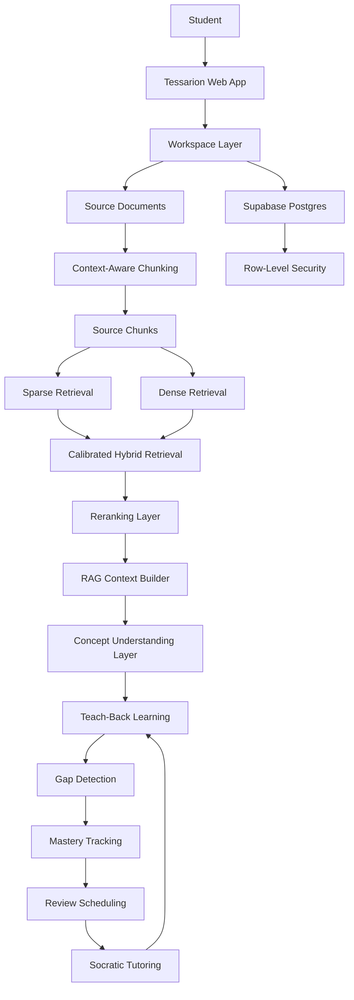
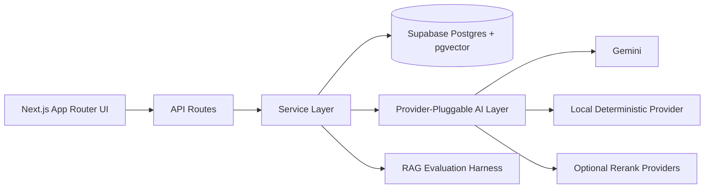
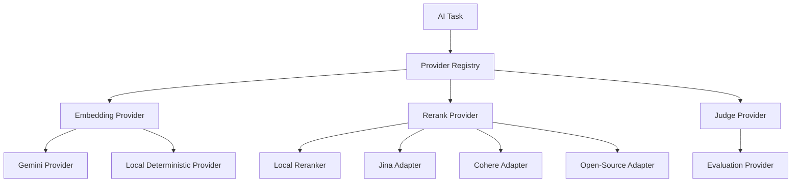
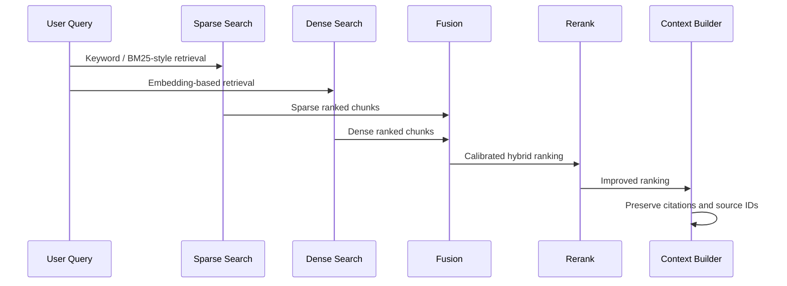
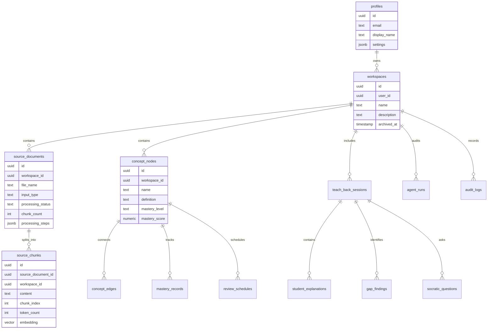
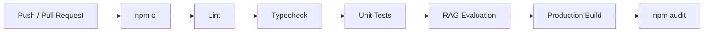
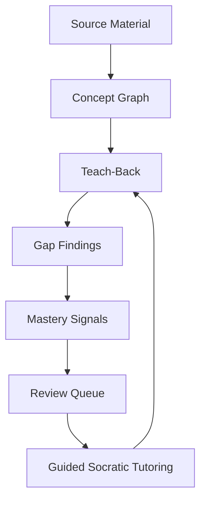

<div align="center">

# Tessarion

### A learning workspace where students understand by teaching.

Tessarion is a source-grounded learning system that helps students turn study material into structured understanding.  
It combines document ingestion, retrieval, concept mapping, teach-back learning, mastery tracking, review scheduling, and guided Socratic tutoring into one focused workspace.

<br />

<a href="#overview"><strong>Overview</strong></a> ·
<a href="#architecture"><strong>Architecture</strong></a> ·
<a href="#rag-foundation"><strong>RAG Foundation</strong></a> ·
<a href="#engineering-quality"><strong>Engineering Quality</strong></a> ·
<a href="#getting-started"><strong>Getting Started</strong></a>

</div>

---

## Overview

Tessarion is designed around a simple learning principle:

> Students understand deeply when they can explain clearly.

Instead of behaving like a generic chatbot or flashcard tool, Tessarion treats learning as a structured workflow:

1. Add source material.
2. Break it into traceable source chunks.
3. Retrieve relevant context from the material.
4. Build concept-level understanding.
5. Let students teach concepts back.
6. Detect gaps, weak links, and misconceptions.
7. Track mastery over time.
8. Schedule evidence-backed reviews.
9. Use guided Socratic tutoring to prepare for another teach-back.

The product is built with a strong emphasis on source grounding, measurable retrieval quality, and explainable learning workflows.

---

## Core Capabilities

| Area | Description |
|---|---|
| Source Material Ingestion | Students can paste study material into a workspace. The system stores the material and chunks it deterministically. |
| Context-Aware Chunking | Study material is split using paragraph-first and heading-aware logic while preserving source traceability. |
| Hybrid Retrieval | Retrieval combines sparse search, dense search, calibrated fusion, and reranking-ready architecture. |
| Provider-Pluggable AI | AI providers are abstracted behind clean interfaces for embeddings, reranking, and evaluation. |
| Local Evaluation Harness | Retrieval, concept, teach-back, mastery, review, and tutoring behavior are evaluated with deterministic local fixtures. |
| Evidence-Based Review Scheduling | Review recommendations are derived from mastery records and signal history, with one active review per concept. |
| Guided Socratic Tutoring | Tutoring uses a deterministic policy to ask one source-grounded question at a time without directly changing mastery. |
| Workspace Isolation | Supabase Row-Level Security keeps each user's data scoped to their own workspaces. |
| CI-Safe Testing | Tests and evaluation run without paid AI APIs or external model calls. |

---

## Product Philosophy

Tessarion is built around four principles:

### 1. Understanding over memorization

The system is designed to help learners explain ideas, connect concepts, and identify weak understanding.

### 2. Source-grounded feedback

Every learning workflow is designed to trace back to the student’s own material.

### 3. Measurable retrieval quality

The retrieval system is not treated as a black box. Tessarion measures retrieval behavior using repeatable local metrics.

### 4. Calm, focused learning

The interface is intentionally minimal, light, and notebook-inspired so the product feels like a serious study environment rather than a noisy dashboard.

---

## Architecture

<div align="center">



</div>

---

## System Layers



### Frontend

- Next.js App Router
- TypeScript
- Light-mode notebook-inspired UI
- Public landing and demo pages
- Authenticated dashboard and workspace surfaces

### Backend

- Supabase Auth
- Supabase Postgres
- Supabase Storage-ready architecture
- Row-Level Security
- API routes with structured validation and error handling

### Retrieval

- Source document ingestion
- Heading-aware chunking
- Sparse retrieval
- Dense retrieval
- Calibrated reciprocal rank fusion
- Local deterministic reranking
- Citation-preserving context construction

### AI Provider Layer

Tessarion is not hard-locked to one provider. AI functionality is routed through provider interfaces:



The local deterministic provider allows retrieval tests and CI checks to run without external AI keys.

---

## RAG Foundation

Tessarion’s retrieval system is built to be testable and measurable.

### Retrieval Pipeline



### Current Offline Retrieval Evaluation

The offline evaluation harness uses deterministic local retrieval and reranking so quality gates can run in CI without external APIs.

| Mode | Recall@3 | Recall@5 | MRR@5 | nDCG@5 | Context Precision@5 |
|---|---:|---:|---:|---:|---:|
| Sparse | 0.875 | 0.916 | 0.875 | 0.875 | 0.854 |
| Pseudo-Dense | 0.958 | 0.958 | 0.861 | 0.857 | 0.847 |
| Hybrid Calibrated | 0.875 | 0.916 | 0.916 | 0.906 | 0.895 |
| Local Rerank | 0.916 | 0.916 | 0.916 | 0.909 | 0.902 |

These metrics are engineering baselines from local deterministic fixtures. Production provider benchmarks can be run separately with configured provider keys.

---

## Data Model



---

## Engineering Quality

Tessarion uses automated checks to keep the codebase stable.

```bash
npm run lint
npm run typecheck
npm run test:run
npm run eval:rag
npm run build
npm audit
```

### Quality Gates

| Check | Purpose |
|---|---|
| Lint | Enforces code quality and prevents stale suppressions. |
| Typecheck | Ensures TypeScript correctness. |
| Tests | Validates utilities, provider interfaces, error handling, and retrieval logic. |
| RAG Eval | Measures retrieval behavior using deterministic fixtures. |
| Build | Verifies the production Next.js build. |
| Audit | Checks dependency vulnerabilities. |

### CI Pipeline

GitHub Actions runs the main quality gates on push and pull request events:



---

## Tech Stack

| Layer | Technology |
|---|---|
| Framework | Next.js |
| Language | TypeScript |
| Database | Supabase Postgres |
| Auth | Supabase Auth |
| Vector Search | pgvector |
| Validation | Zod |
| Testing | Vitest |
| CI | GitHub Actions |
| AI SDK | Vercel AI SDK |
| AI Providers | Provider-pluggable architecture |
| Retrieval Evaluation | Custom local RAG evaluation harness |

---

## Getting Started

### 1. Install dependencies

```bash
npm install
```

### 2. Create local environment file

Create:

```bash
.env.local
```

Use `.env.example` as the reference.

Required for Supabase-backed app flows:

```env
NEXT_PUBLIC_SUPABASE_URL=
NEXT_PUBLIC_SUPABASE_ANON_KEY=
SUPABASE_SERVICE_ROLE_KEY=
```

Optional AI provider keys:

```env
GOOGLE_GENERATIVE_AI_API_KEY=
JINA_API_KEY=
COHERE_API_KEY=
HUGGINGFACE_API_KEY=
```

The local test and evaluation pipeline does not require external AI keys.

### 3. Run development server

```bash
npm run dev
```

### 4. Run checks

```bash
npm run lint
npm run typecheck
npm run test:run
npm run eval:rag
npm run build
npm audit
```

---

## Project Structure

```txt
app/
  api/
  demo/
  (auth)/
  (app)/

components/
  site/
  ui/

eval/
  rag/

lib/
  ai/
    providers/
    tasks/
  config/
  errors/
  rag/
  services/
  supabase/
  validation/

supabase/
  migrations/

types/
```

---


## Learning Workflow

Tessarion now treats learning as an evidence loop:



Tutoring does not directly mark a concept as understood. It prepares the learner to attempt another teach-back, which remains the evidence source for mastery changes.

---

## Public Documentation

- `docs/public-rag-foundation.md`
- `docs/public-concept-graph-foundation.md`
- `docs/public-mastery-model.md`
- `docs/public-review-scheduling.md`
- `docs/public-socratic-tutoring.md`

---

## Security Model

Tessarion is designed with a strict separation between public, authenticated, and server-only code.

| Area | Approach |
|---|---|
| User Data | Scoped by workspace ownership. |
| Database Access | Protected by Supabase Row-Level Security. |
| Service Role | Server-only and never imported into client components. |
| Public Demo | Static and non-personalized. |
| AI Provider Keys | Optional, server-only, never committed. |
| CI Evaluation | Runs without external AI credentials. |
| Private Docs | Kept under ignored private documentation paths. |

---

## Development Principles

- Keep source grounding explicit.
- Do not generate unsupported learning feedback.
- Avoid unsupported live behavior and keep user-visible outputs grounded in stored evidence.
- Keep provider integrations optional and benchmarkable.
- Prefer measurable retrieval quality over vague claims.
- Keep private architecture decisions outside the public repository.
- Maintain clean CI gates before expanding product capabilities.
- Keep tutoring separate from mastery updates; learners demonstrate progress through teach-back.

---

<div align="center">

### Tessarion

A focused workspace for students who want to understand deeply, not just remember temporarily.

</div>
