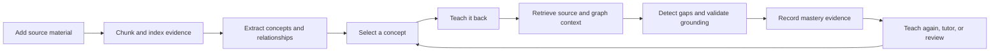
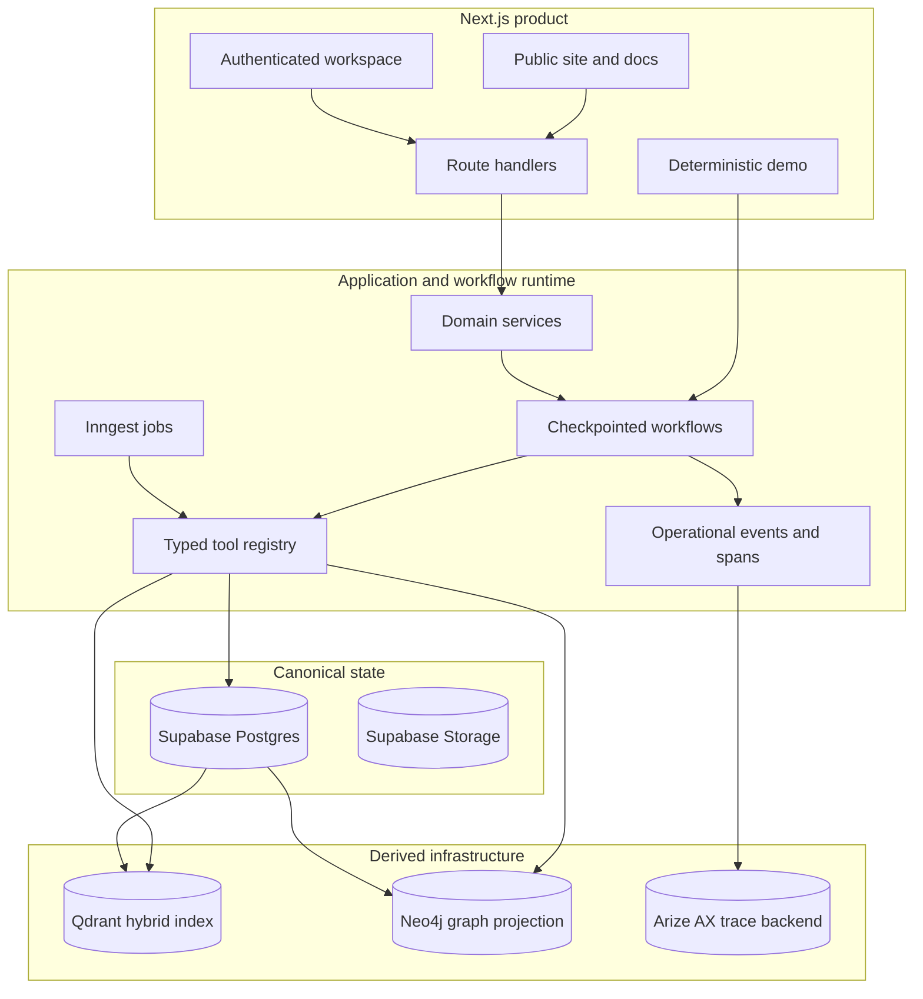
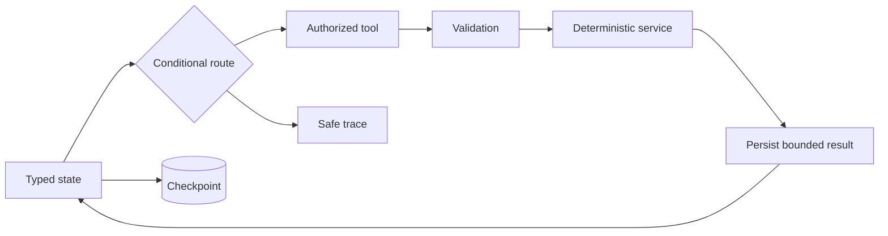
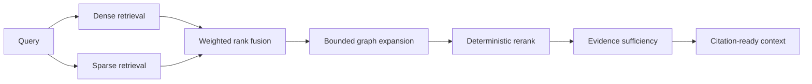

<div align="center">


# Tessarion

### Evidence-linked learning through teach-back, retrieval, concept graphs, and guided recovery

[Live Demo](#public-demo) · [Architecture](#architecture) · [Agentic System](#agentic-system) · [Evaluation](#evaluation) · [Documentation](#documentation) · [Deployment](#deployment)

</div>

---

## Product

Tessarion turns study material into a traceable learning workspace. A learner explains a concept in their own words. The system retrieves source evidence, inspects concept dependencies, identifies gaps, records mastery evidence, and routes the learner to another attempt, Socratic tutoring, or review.

The product is built around one question:

> Can the learner reconstruct the idea, connect it to the right concepts, and support the explanation with evidence?

Tessarion does not infer understanding from clicks, time-on-page, streaks, or polished wording.

**Release status:** the complete product workflow is implemented and deployed across Supabase, Qdrant, Neo4j, Inngest, and Arize AX. The remaining release activity is demo capture and presentation packaging, not product functionality.

### Core boundaries

- **Evidence before confidence** — important learning decisions point to source chunks or concept evidence.
- **Deterministic rules where possible** — scoring, validation, authorization, review scheduling, graph bounds, and persistence remain tested services.
- **Stateful workflows where needed** — diagnosis and tutoring use explicit states, tools, checkpoints, retries, and terminal outcomes.
- **One canonical store** — Supabase/Postgres owns learner records; vector and graph systems are rebuildable projections.
- **Inspectable decisions** — evidence references, workflow steps, tool activity, and safe traces remain visible.

---

## Learning loop


```mermaid
flowchart LR
    A[Add source material] --> B[Chunk and index evidence]
    B --> C[Extract concepts and relationships]
    C --> D[Select a concept]
    D --> E[Teach it back]
    E --> F[Retrieve source and graph context]
    F --> G[Detect gaps and validate grounding]
    G --> H[Record mastery evidence]
    H --> I[Teach again, tutor, or review]
    I --> D
```

| Stage | System responsibility |
|---|---|
| Source ingestion | Store learner material and create bounded source chunks. |
| Concept intelligence | Extract concepts and evidence-bearing relationships. |
| Teach-back | Capture the learner explanation without rewarding verbosity. |
| Diagnosis | Separate omissions, shallow explanations, unsupported claims, and misconceptions. |
| Tutoring | Ask one targeted question at a time and return the learner to teach-back. |
| Mastery and review | Record evidence and schedule review without presenting false precision. |

---

## Product surfaces

### Public

- product landing page with an evidence-linked diagnosis report;
- interactive capability explorer;
- technical documentation with Cytoscape diagrams;
- learning-method guide;
- video walkthrough;
- deterministic public notebook covering computer architecture and memory systems.

### Authenticated workspace

- notebook dashboard;
- source ingestion and processing state;
- concept graph and evidence inspector;
- teach-back composer and diagnosis report;
- Socratic tutoring sessions;
- evidence-based review queue;
- activity and trace timeline;
- system-readiness panel.

---

## Architecture


```mermaid
flowchart TB
    subgraph Product[Next.js product]
      Public[Public site and docs]
      Demo[Deterministic demo]
      Workspace[Authenticated workspace]
      API[Route handlers]
    end

    subgraph Runtime[Application and workflow runtime]
      Services[Domain services]
      Workflows[Checkpointed workflows]
      Tools[Typed tool registry]
      Jobs[Inngest jobs]
      Traces[Operational events and spans]
    end

    subgraph Canonical[Canonical state]
      Postgres[(Supabase Postgres)]
      Storage[(Supabase Storage)]
    end

    subgraph Derived[Derived infrastructure]
      Qdrant[(Qdrant hybrid index)]
      Neo4j[(Neo4j graph projection)]
      Arize[(Arize AX trace backend)]
    end

    Public --> API
    Demo --> Workflows
    Workspace --> API
    API --> Services
    Services --> Workflows
    Workflows --> Tools
    Workflows --> Traces
    Jobs --> Tools
    Tools --> Postgres
    Tools --> Qdrant
    Tools --> Neo4j
    Postgres --> Qdrant
    Postgres --> Neo4j
    Traces --> Arize
```

### Ownership

| Data | Canonical owner | Derived system |
|---|---|---|
| Users, workspaces, documents, source chunks | Supabase/Postgres | — |
| Concepts and canonical relationships | Supabase/Postgres | Neo4j |
| Dense and sparse vectors | Source chunks in Postgres | Qdrant |
| Explanations, gaps, mastery, reviews | Supabase/Postgres | Optional semantic index |
| Workflow checkpoints | Supabase/Postgres | Trace timeline |
| Operational events | Supabase/Postgres | OTLP collector |

A failure in Qdrant, Neo4j, or trace storage can reduce a feature, but it cannot overwrite canonical learner data.

---

## Agentic system

Tessarion uses a stateful workflow only when the task requires conditional routing, tool use, interruption, resume, or multi-step validation. Ordinary model calls are not labelled as agents.

### Workflow families


```mermaid
flowchart LR
    A[Typed state] --> B{Conditional route}
    B --> C[Authorized tool]
    C --> D[Validation]
    D --> E[Deterministic service]
    E --> F[Persist bounded result]
    F --> A
    A --> G[(Checkpoint)]
    B --> H[Safe trace]
```

- **Concept Intelligence** — source loading, candidate extraction, entity resolution, relationship validation, and projection preparation.
- **Learning Diagnosis** — evidence retrieval, graph context, gap classification, grounding, mastery, review, and next-action selection.
- **Socratic Tutor** — active-gap selection, one-question policy, learner interruption, response evaluation, completion, and return to teach-back.

### Tool contract

Every tool defines:

- Zod input and output schemas;
- user and workspace scope;
- read or write classification;
- timeout and retry policy;
- idempotency policy;
- safe errors and audit events;
- MCP exposure policy.

### Memory

| Memory | Storage |
|---|---|
| Active workflow state | Checkpoint store |
| Teach-back and tutor sessions | Postgres |
| Learner mastery and review state | Postgres |
| Semantic retrieval memory | Qdrant projection |
| Concept dependencies | Neo4j projection |
| Operational history | Events and trace spans |

Hidden reasoning is not stored. Tessarion stores structured decisions, evidence IDs, tool results, validation outcomes, and safe summaries.

---

## Hybrid retrieval and graph reasoning


```mermaid
flowchart LR
    Q[Query] --> D[Dense retrieval]
    Q --> S[Sparse retrieval]
    D --> F[Weighted rank fusion]
    S --> F
    F --> G[Bounded graph expansion]
    G --> R[Deterministic rerank]
    R --> E[Evidence sufficiency]
    E --> C[Citation-ready context]
```

The retrieval pipeline enforces workspace isolation, bounded candidate counts, preserved source IDs, explicit insufficiency, and deterministic local evaluation.

---

## Public demo

The public notebook at `/demo/notebook` requires no account and writes no user data.

**Topic:** Computer Architecture and Memory Systems

It includes:

- a focused source covering CPU execution, pipelining, hazards, memory hierarchy, buses, interrupts, and DMA;
- 29 concepts and evidence-linked relationships;
- six teach-back scenarios;
- dynamic diagnosis comparison;
- an interactive Cytoscape graph;
- an eight-turn tutoring sequence;
- review reasoning;
- a nine-step workflow trace.

---

## Evaluation

Tessarion uses versioned datasets and metric-producing runners. External providers are not required for the deterministic regression suite.

| Command | Coverage |
|---|---|
| `npm run eval:rag` | Recall@K, MRR, nDCG, context precision |
| `npm run eval:concepts` | Concept and relationship precision, recall, F1, grounding |
| `npm run eval:teachback` | Gap detection, grounding, unsupported claims, follow-up targeting |
| `npm run eval:mastery` | Mastery-state and recommendation accuracy |
| `npm run eval:review` | Scheduling, idempotency, stale override, traceability |
| `npm run eval:tutoring` | Move selection, one-question policy, grounding, completion |
| `npm run eval:diagnosis` | Route, mastery, next action, gap set, repeatability |
| `npm run eval:retrieval-v2` | Hybrid retrieval quality and workspace isolation |
| `npm run eval:graph-v2` | Graph recall, evidence recall, depth and workspace bounds |
| `npm run eval:resilience-v2` | Retries, write safety, checkpoints, resume, loop bounds |
| `npm run eval:release-v1` | Frozen release dataset floor |
| `npm run eval:integration` | Routes, shell boundaries, accessibility, licensing |
| `npm run eval:performance` | Panel-scoped queries and bounded network behaviour |

The frozen release suite is a regression floor, not a claim of complete benchmark coverage.

---

## Technology

| Area | Stack |
|---|---|
| Web | Next.js 16, React 19, TypeScript |
| UI | Radix Primitives, Motion, Cytoscape.js, Lucide |
| Validation | Zod |
| Canonical data | Supabase Auth, Postgres, Storage, RLS |
| Background work | Inngest |
| Retrieval | Deterministic local adapters and Qdrant |
| Graph | Postgres canonical relationships and Neo4j projection |
| Testing | Vitest and metric-producing evaluation runners |
| Deployment | Vercel, Supabase, Qdrant Cloud, Neo4j AuraDB, Arize AX |

---

## Local setup

### Requirements

- Node.js 24
- npm 10+
- Docker Desktop
- Supabase CLI

### Install

```cmd
cd C:\Projects\Tessarion
npm ci
copy .env.example .env.local
supabase start
supabase db reset
npm run dev
```

### Required environment variables

```env
NEXT_PUBLIC_SUPABASE_URL=
NEXT_PUBLIC_SUPABASE_ANON_KEY=
SUPABASE_SERVICE_ROLE_KEY=
GOOGLE_GENERATIVE_AI_API_KEY=
```

### Optional infrastructure

```env
QDRANT_URL=
QDRANT_API_KEY=
QDRANT_COLLECTION=tessarion_workspace_chunks_v1
QDRANT_DENSE_VECTOR_SIZE=768

NEO4J_URI=
NEO4J_USERNAME=
NEO4J_PASSWORD=
NEO4J_DATABASE=neo4j

ARIZE_SPACE_ID=
ARIZE_API_KEY=
ARIZE_PROJECT_NAME=tessarion
ARIZE_OTLP_ENDPOINT=https://otlp.arize.com/v1/traces
OTEL_SERVICE_NAME=tessarion
```

### Quality gate

```cmd
npm run lint
npm run typecheck
npm run test:run
npm run eval:release-v1
npm run deploy:check
npm run build
```

---

## Deployment

Production uses a hosted, layered topology:

1. Supabase for canonical authentication and learner data.
2. Vercel for the Next.js application and API routes.
3. Qdrant Cloud for rebuildable dense and sparse retrieval indexes.
4. Neo4j AuraDB for the rebuildable concept-graph projection.
5. Inngest Cloud for durable background execution and retries.
6. Arize AX for authenticated OTLP workflow traces.

The local infrastructure commands load `.env.local` automatically:

```cmd
npm run infra:bootstrap
npm run infra:validate
```

Detailed instructions:

- [Production topology and deployment order](docs/deployment/DEPLOYMENT.md)
- [Vercel configuration](docs/deployment/VERCEL.md)
- [Production end-to-end validation](docs/deployment/PRODUCTION-VALIDATION.md)
- [Authentication email delivery](docs/deployment/AUTH-EMAIL.md)

---

## Documentation

- [Product overview](docs/rebuild/00-rebuild-charter.md)
- [Architecture](docs/rebuild/02-target-architecture.md)
- [Agent orchestration](docs/rebuild/03-agent-orchestration.md)
- [Tools and MCP](docs/rebuild/04-tool-and-mcp-contracts.md)
- [Hybrid retrieval and graph reasoning](docs/rebuild/05-hybrid-rag-and-graph-retrieval.md)
- [Memory model](docs/rebuild/06-memory-and-learner-model.md)
- [Evaluation](docs/rebuild/08-evaluation-and-improvement.md)
- [Security](docs/public-security-model.md)
- [Observability](docs/public-observability-model.md)
- [Deployment](docs/deployment/DEPLOYMENT.md)

---

## Current status

The first production release path is implemented across the full stack:

| Capability | Production path |
|---|---|
| Authentication and canonical records | Supabase |
| Public site and learner workspace | Vercel |
| Retrieval projection | Qdrant Cloud |
| Concept-graph projection | Neo4j AuraDB |
| Durable background jobs | Inngest Cloud |
| Workflow tracing | Arize AX |
| Regression and release evaluation | Vitest and versioned evaluation runners |

The application remains usable through bounded local fallbacks when an optional derived service is unavailable. Supabase/Postgres remains the only canonical owner of learner records.

The next product version can focus on new learner-facing capabilities, UI refinement, and performance work without changing these ownership boundaries.

---

## Auth-aware application shell

Tessarion uses cookie-based Supabase SSR authentication across public and protected routes. The Next.js proxy refreshes the session before server rendering, while the shared header resolves the current account from the refreshed cookie.

After authentication:

- **Start learning** becomes **Dashboard**.
- The profile menu exposes account identity, profile settings, and sign-out.
- `/profile`, `/dashboard`, and `/workspace/*` use the same server-side session boundary.
- Session-aware responses are not shared through public caches.

---

## License

Apache License 2.0. See [`LICENSE`](LICENSE) and [`NOTICE`](NOTICE).
