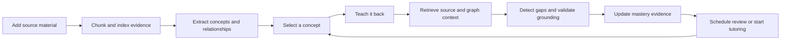
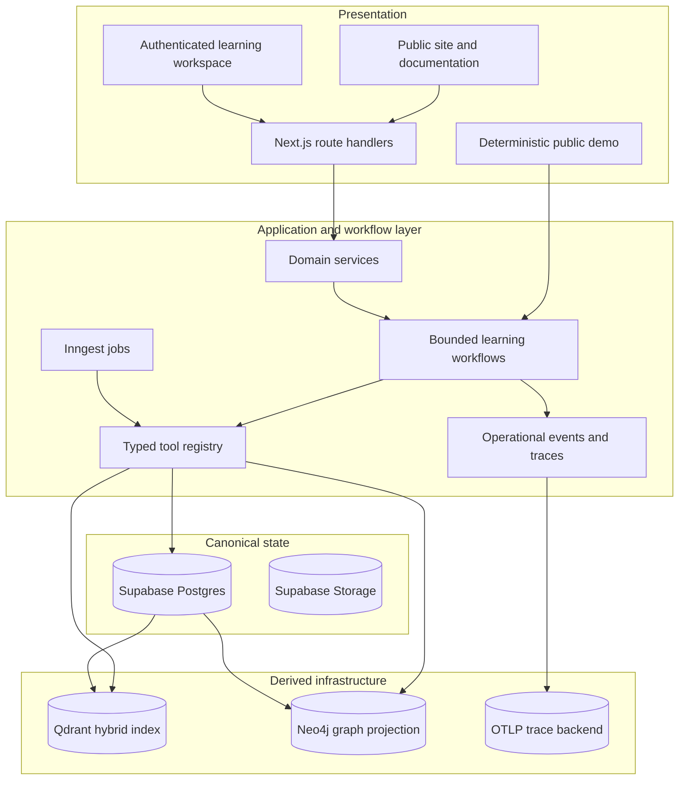
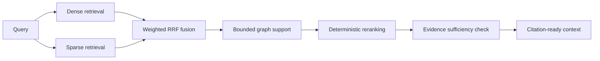
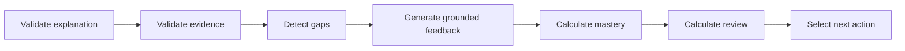
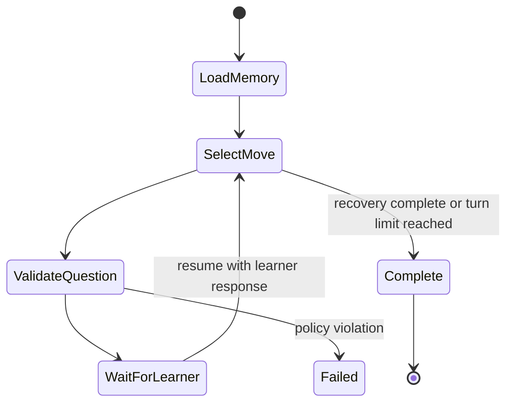
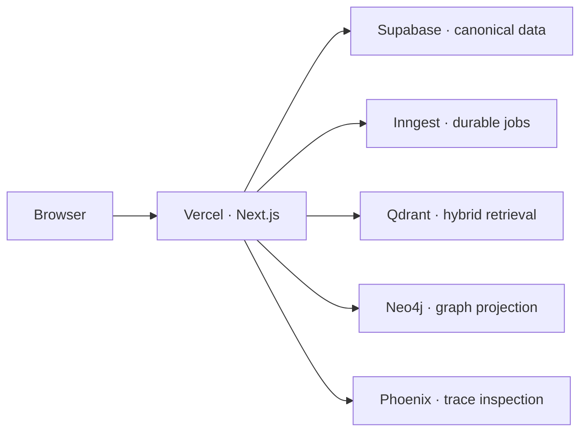

<div align="center">


# Tessarion

### Evidence-linked learning through teach-back, concept graphs, retrieval, and guided recovery

Tessarion turns study material into a traceable learning workspace. Learners explain concepts in their own words; the system compares those explanations with source evidence, identifies gaps, updates mastery records, schedules review, and guides recovery through bounded Socratic workflows.

[Public Demo](#public-demo) · [Documentation](#documentation) · [Architecture](#architecture) · [Evaluation](#evaluation) · [Local Setup](#local-setup)

</div>

---

## Why Tessarion exists

Most study tools optimise for reading, highlighting, or answering questions. Tessarion is built around a stricter test:

> Can the learner explain a concept accurately, connect it to its prerequisites, and support that explanation with evidence?

The product does not infer understanding from clicks, streaks, or polished prose. It records source-linked evidence, diagnosed gaps, explicit uncertainty, mastery signals, review decisions, and workflow traces.

### Product principles

- **Evidence before confidence** — important learning decisions point to source material or explicitly report insufficient evidence.
- **Deterministic rules where possible** — mastery transitions, review scheduling, validation, graph bounds, and authorisation remain tested services.
- **Bounded workflows** — diagnosis and tutoring routes have explicit states, limits, fallbacks, and terminal outcomes.
- **Canonical ownership** — Supabase/Postgres remains the source of truth; vector and graph systems are rebuildable projections.
- **Inspectable decisions** — evidence, workflow stages, tool activity, and safe operational traces remain reviewable.

---

## Learning flow


```mermaid
flowchart LR
    A[Add source material] --> B[Chunk and index evidence]
    B --> C[Extract concepts and relationships]
    C --> D[Select a concept]
    D --> E[Teach it back]
    E --> F[Retrieve source and graph context]
    F --> G[Detect gaps and validate grounding]
    G --> H[Update mastery evidence]
    H --> I[Schedule review or start tutoring]
    I --> D
```

| Stage | What Tessarion does |
|---|---|
| Source ingestion | Stores learner material and creates bounded evidence chunks. |
| Concept intelligence | Extracts concepts and evidence-backed relationships. |
| Teach-back | Captures the learner's explanation without rewarding verbosity alone. |
| Diagnosis | Detects missing concepts, unsupported claims, prerequisite confusion, and direct misconceptions. |
| Socratic tutoring | Asks one targeted question at a time and returns the learner to teach-back. |
| Mastery and review | Updates learner state from recorded evidence rather than opaque scores. |

---

## Product surfaces

### Public experience

- centred Tessarion hero with custom concept-network artwork;
- evidence-linked diagnosis preview;
- interactive capability explorer;
- consolidated technical documentation with controllable Cytoscape diagrams;
- learning-methods guide covering teach-back, retrieval practice, elaboration, Socratic questioning, spacing, and metacognition;
- guided video page and deterministic public notebook.

### Authenticated workspace

- notebook dashboard and workspace navigation shell;
- source ingestion and processing state;
- concept graph explorer and evidence inspector;
- teach-back composer and diagnosis report;
- bounded Socratic tutoring sessions;
- priority-based review queue;
- activity timeline and safe trace view;
- system-readiness reporting for configured and fallback components.

### Engineering foundations

- versioned prompt contracts;
- typed internal tool registry and protected MCP route;
- deterministic diagnosis, concept-intelligence, and tutoring workflow cores;
- checkpointed runtime with in-memory and Supabase persistence;
- dense/sparse hybrid retrieval with weighted reciprocal-rank fusion;
- Qdrant REST and indexing adapters;
- bounded graph projection and Neo4j query adapter;
- retry-aware tool execution;
- operational events, redaction, and OTLP-compatible trace export;
- integration, accessibility, performance, and release-quality gates.

---

## Architecture


```mermaid
flowchart TB
    subgraph Presentation[Presentation]
      Public[Public site and documentation]
      Demo[Deterministic public demo]
      Workspace[Authenticated learning workspace]
      Routes[Next.js route handlers]
    end

    subgraph Application[Application and workflow layer]
      Services[Domain services]
      Workflows[Bounded learning workflows]
      Tools[Typed tool registry]
      Jobs[Inngest jobs]
      Traces[Operational events and traces]
    end

    subgraph Canonical[Canonical state]
      Postgres[(Supabase Postgres)]
      Storage[(Supabase Storage)]
    end

    subgraph Derived[Derived infrastructure]
      Qdrant[(Qdrant hybrid index)]
      Neo4j[(Neo4j graph projection)]
      Phoenix[(OTLP trace backend)]
    end

    Public --> Routes
    Demo --> Workflows
    Workspace --> Routes
    Routes --> Services
    Services --> Workflows
    Workflows --> Tools
    Workflows --> Traces
    Jobs --> Tools
    Tools --> Postgres
    Tools --> Qdrant
    Tools --> Neo4j
    Postgres --> Qdrant
    Postgres --> Neo4j
    Traces --> Phoenix
```

### Responsibility boundaries

| Layer | Responsibility |
|---|---|
| Next.js 16 | Public pages, documentation, authenticated workspace, route handlers, loading and recovery states |
| Supabase | Authentication, Postgres, Storage, row-level security, canonical learner records |
| Domain services | Validation, authorisation, persistence, mastery calculations, review scheduling |
| Workflow runtime | Diagnosis, concept intelligence, tutoring, checkpoints, interruption, and resume |
| Typed tools | Schema validation, workspace scoping, timeouts, retries, and safe errors |
| Qdrant | Derived dense and sparse retrieval index |
| Neo4j | Derived concept traversal projection |
| Inngest | Retryable background processing and scheduled work |
| Operational tracing | Safe activity history, evidence references, workflow diagnostics, and OTLP export |

### Data ownership

| Data | Canonical owner | Derived copy |
|---|---|---|
| Users, workspaces, documents, source chunks | Supabase/Postgres | — |
| Concepts and canonical relationships | Supabase/Postgres | Neo4j projection |
| Dense and sparse vectors | Source chunks in Postgres | Qdrant |
| Explanations, gaps, mastery, reviews | Supabase/Postgres | Optional retrieval summaries |
| Workflow checkpoints | Supabase/Postgres | Trace visualisation |
| Operational events | Supabase/Postgres | OTLP-compatible trace backend |

Qdrant, Neo4j, and external trace storage remain rebuildable. They never become competing canonical stores.

---

## Retrieval and graph reasoning


```mermaid
flowchart LR
    Q[Query] --> D[Dense retrieval]
    Q --> S[Sparse retrieval]
    D --> F[Weighted RRF fusion]
    S --> F
    F --> G[Bounded graph support]
    G --> R[Deterministic reranking]
    R --> E[Evidence sufficiency check]
    E --> C[Citation-ready context]
```

The retrieval pipeline enforces:

- mandatory workspace isolation;
- optional document filters;
- bounded candidate counts;
- deterministic local operation for CI and fallback use;
- explicit insufficient-evidence results;
- source identifiers preserved through ranking and diagnosis.

---

## Workflow model

### Learning diagnosis


```mermaid
flowchart LR
    A[Validate explanation] --> B[Validate evidence]
    B --> C[Detect gaps]
    C --> D[Generate grounded feedback]
    D --> E[Calculate mastery]
    E --> F[Calculate review]
    F --> G[Select next action]
```

### Socratic tutoring


```mermaid
stateDiagram-v2
    [*] --> LoadMemory
    LoadMemory --> SelectMove
    SelectMove --> ValidateQuestion
    ValidateQuestion --> WaitForLearner
    WaitForLearner --> SelectMove: resume with learner response
    SelectMove --> Complete: recovery complete or turn limit reached
    ValidateQuestion --> Failed: policy violation
    Complete --> [*]
```

The tutor asks at most one question per turn and does not silently mark mastery. Completion returns the learner to another teach-back attempt.

---

## Public demo

The public notebook at `/demo/notebook` demonstrates the product model without requiring an account or external provider key.

**Topic:** Computer Memory Hierarchy

It includes:

- one compact source document;
- fourteen concepts and evidence-backed relationships;
- six teach-back scenarios;
- grounded, partial, shallow, prerequisite, unsupported, and misconception outcomes;
- dynamic diagnosis and comparison;
- a bounded tutoring sequence;
- review reasoning;
- a nine-step execution trace.

The demo is deterministic and does not write user data.

---

## Evaluation

Tessarion uses versioned datasets and metric-producing runners. External providers are not required for the core regression suite.

| Command | Coverage |
|---|---|
| `npm run eval:rag` | Recall@K, MRR, nDCG, context precision |
| `npm run eval:concepts` | Concept and relationship precision, recall, F1, grounding |
| `npm run eval:teachback` | Gap detection, grounding, unsupported claims, follow-up targeting |
| `npm run eval:mastery` | Mastery-state and recommendation accuracy |
| `npm run eval:review` | Scheduling, idempotency, stale override, traceability |
| `npm run eval:tutoring` | Move selection, one-question policy, grounding, completion |
| `npm run eval:diagnosis` | Route, mastery, next-action, gap-set, repeatability |
| `npm run eval:retrieval-v2` | Hybrid retrieval quality and workspace isolation |
| `npm run eval:graph-v2` | Graph recall, evidence recall, depth and workspace bounds |
| `npm run eval:resilience-v2` | Retries, write safety, checkpointing, resume, loop bounds |
| `npm run eval:release-v1` | Frozen release dataset floor |
| `npm run eval:integration` | Required routes, shell boundaries, accessibility, licensing |
| `npm run eval:performance` | Panel-scoped queries, public-route isolation, bounded network behaviour |

The frozen release gate is a regression floor, not a claim of benchmark completeness.

---

## Technology

| Area | Stack |
|---|---|
| Web application | Next.js 16, React 19, TypeScript |
| Validation | Zod |
| Canonical data | Supabase Auth, Postgres, Storage, RLS |
| Background work | Inngest |
| Retrieval | Local deterministic adapters, Qdrant contracts |
| Graph | Cytoscape.js visualisation, Neo4j projection contracts |
| UI | Radix primitives, Motion, Lucide icons |
| State | TanStack Query, Zustand |
| Testing | Vitest and deterministic evaluation runners |
| Deployment | Vercel, Supabase, optional Qdrant Cloud, Neo4j AuraDB, Phoenix |

---

## Local setup

### Requirements

- Node.js 24
- npm 10+
- Docker Desktop
- Supabase CLI

### Install

```cmd
cd C:\Projects\Tessarion
npm ci
copy .env.example .env.local
supabase start
supabase db reset
npm run dev
```

Use `supabase status` to obtain the local URL and public key, then copy the matching values into `.env.local`.

### Required variables

```env
NEXT_PUBLIC_SUPABASE_URL=
NEXT_PUBLIC_SUPABASE_ANON_KEY=
SUPABASE_SERVICE_ROLE_KEY=
GOOGLE_GENERATIVE_AI_API_KEY=
NEXT_PUBLIC_SITE_URL=http://localhost:3000
TESSARION_APP_URL=http://localhost:3000
```

Optional infrastructure variables are documented in [`.env.example`](.env.example) and [`docs/deployment/DEPLOYMENT.md`](docs/deployment/DEPLOYMENT.md).

### Validation

```cmd
npm run lint
npm run typecheck
npm run test:run
npm run deploy:check
npm run build
```

---

## Deployment


```mermaid
flowchart LR
    Browser --> Vercel[Vercel · Next.js]
    Vercel --> Supabase[Supabase · canonical data]
    Vercel --> Inngest[Inngest · durable jobs]
    Vercel --> Qdrant[Qdrant · hybrid retrieval]
    Vercel --> Neo4j[Neo4j · graph projection]
    Vercel --> Phoenix[Phoenix · trace inspection]
```

Deployment references:

- [`docs/deployment/VERCEL.md`](docs/deployment/VERCEL.md) — Vercel configuration and environment variables;
- [`docs/deployment/DEPLOYMENT.md`](docs/deployment/DEPLOYMENT.md) — complete infrastructure sequence;
- [`docs/deployment/AUTH-EMAIL.md`](docs/deployment/AUTH-EMAIL.md) — production email and SMTP setup.

Run before deployment:

```cmd
npm run deploy:check
npm run build
```

---

## Security and reliability

- Authenticated routes derive identity from the server-side session.
- Row-level security protects canonical learner data.
- Service-role access remains server-only.
- Workspace identifiers are mandatory in retrieval and graph operations.
- Input lengths, turn counts, candidate counts, retries, and metadata sizes are bounded.
- Provider and database errors are normalised before reaching clients.
- Operational metadata is redacted before persistence or export.
- Traces store structured decisions and evidence identifiers, not hidden reasoning.
- Public pages and the demo do not depend on authenticated Supabase requests.
- Critical runtime dependency advisories block CI; complete dependency findings remain visible.

---

## Documentation

- [`docs/rebuild/`](docs/rebuild/) — architecture and migration contracts;
- [`docs/rebuild/implementation/`](docs/rebuild/implementation/) — implementation records;
- [`docs/public-rag-foundation.md`](docs/public-rag-foundation.md) — retrieval model;
- [`docs/public-concept-graph-foundation.md`](docs/public-concept-graph-foundation.md) — graph model;
- [`docs/public-mastery-model.md`](docs/public-mastery-model.md) — mastery evidence model;
- [`docs/public-review-scheduling.md`](docs/public-review-scheduling.md) — review policy;
- [`docs/public-socratic-tutoring.md`](docs/public-socratic-tutoring.md) — tutoring policy;
- [`docs/public-security-model.md`](docs/public-security-model.md) — security boundaries;
- [`docs/public-observability-model.md`](docs/public-observability-model.md) — event and trace policy.

---

## License

Copyright 2026 Dhruv Gupta.

Licensed under the [Apache License 2.0](LICENSE). Redistribution and derivative works must preserve the applicable copyright, licence, and attribution notices. See [NOTICE](NOTICE).

<div align="center">

**Tessarion is built as an inspectable learning system, not a black-box answer generator.**

</div>
