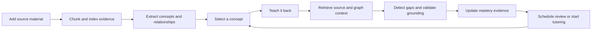
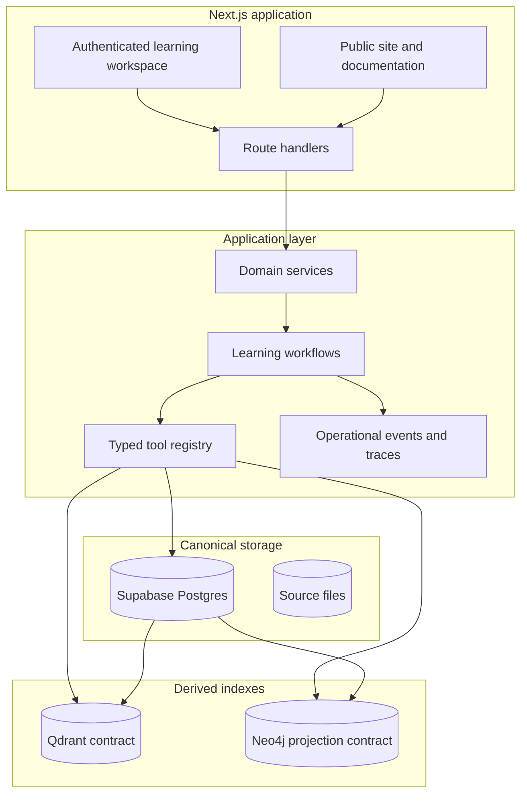
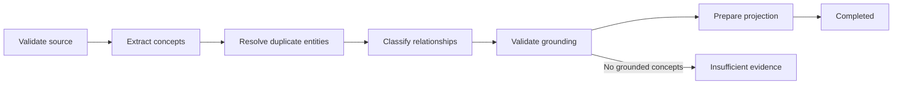
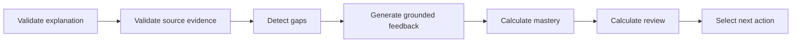
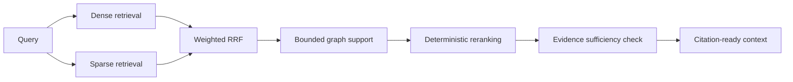

<div align="center">

# Tessarion

### Evidence-linked learning through teach-back, concept graphs, retrieval, and guided recovery

Tessarion turns source material into a traceable learning model. Learners explain a concept in their own words; the system checks that explanation against source evidence, identifies gaps, updates mastery records, schedules review, and guides recovery through bounded Socratic workflows.

[Architecture](#architecture) · [Learning Loop](#learning-loop) · [Evaluation](#evaluation) · [Local Setup](#local-setup) · [Documentation](#documentation)

</div>

---

## Why Tessarion exists

Most study tools optimize for consumption: summaries, flashcards, generated notes, or chat responses. Tessarion focuses on a harder question:

> Can a learner explain the concept accurately, connect it to its prerequisites, and support that explanation with evidence?

The product is built around teach-back. Understanding is not inferred from clicks, streaks, or polished answers. It is represented through source-linked evidence, detected gaps, explicit uncertainty, review signals, and repeatable workflow traces.

## Learning loop


```mermaid
flowchart LR
    A[Add source material] --> B[Chunk and index evidence]
    B --> C[Extract concepts and relationships]
    C --> D[Select a concept]
    D --> E[Teach it back]
    E --> F[Retrieve source and graph context]
    F --> G[Detect gaps and validate grounding]
    G --> H[Update mastery evidence]
    H --> I[Schedule review or start tutoring]
    I --> D
```

The loop is intentionally evidence-first:

1. **Sources are canonical.** Every concept, relationship, and learning decision must link back to stored source chunks.
2. **Uncertainty is explicit.** Missing evidence produces an insufficient-evidence result rather than a confident guess.
3. **Deterministic rules remain deterministic.** Mastery transitions, review scheduling, graph bounds, validation, and authorization are implemented as tested services.
4. **Stateful workflows are bounded.** Multi-step learning workflows have explicit terminal states, turn limits, safe fallbacks, and trace records.

## Architecture


```mermaid
flowchart TB
    subgraph Client[Next.js application]
      Public[Public site and documentation]
      Workspace[Authenticated learning workspace]
      API[Route handlers]
    end

    subgraph Application[Application layer]
      Services[Domain services]
      Workflows[Learning workflows]
      Tools[Typed tool registry]
      Observability[Operational events and traces]
    end

    subgraph Canonical[Canonical storage]
      Postgres[(Supabase Postgres)]
      Storage[(Source files)]
    end

    subgraph Derived[Derived indexes]
      Vector[(Qdrant contract)]
      Graph[(Neo4j projection contract)]
    end

    Workspace --> API
    API --> Services
    Services --> Workflows
    Workflows --> Tools
    Tools --> Postgres
    Tools --> Vector
    Tools --> Graph
    Workflows --> Observability
    Postgres --> Vector
    Postgres --> Graph
    Public --> API
```

### Responsibility boundaries

| Layer | Responsibility |
|---|---|
| Next.js | Public pages, authenticated workspace, route handlers, streaming UI |
| Supabase | Authentication, row-level security, canonical transactional records |
| Domain services | Validation, authorization, persistence, mastery and review logic |
| Workflow cores | Stateful learning routes, bounded transitions, interruption contracts |
| Typed tools | Schema validation, workspace scoping, timeouts, safe errors |
| Qdrant contract | Dense and sparse derived retrieval indexes |
| Neo4j contract | Derived concept traversal projection |
| Inngest | Retryable background jobs and scheduled execution |
| Evaluation harness | Deterministic metrics and regression gates |
| Operational tracing | Safe event and workflow diagnostics |

## Rebuild engineering status

The repository is being rebuilt in controlled layers. Current implementation status is stated explicitly below.

### Implemented foundations

- Supabase authentication, database schema, row-level security, and storage contracts
- Source ingestion and deterministic chunking
- Provider-pluggable embedding and retrieval interfaces
- Teach-back analysis, mastery calculation, review scheduling, and tutoring policies
- Operational event logging with bounded metadata and redaction
- Versioned prompt registry contracts
- Typed internal tool registry
- Workflow state and trace contracts
- Deterministic Learning Diagnosis workflow
- Dense/sparse hybrid retrieval pipeline with weighted reciprocal-rank fusion
- Qdrant REST and indexing contracts
- Canonical-to-derived knowledge-graph projection contracts
- Bounded local graph traversal and graph-supported retrieval boosts
- Concept Intelligence workflow core
- Socratic Tutor workflow core with interruption checkpoints
- Framework-neutral workflow checkpoint contract with deterministic in-memory history
- MCP exposure manifest derived from the authorized internal tool registry
- Versioned local evaluation datasets

### Planned integration work

- LangGraph adapter and durable Postgres-backed checkpoints
- Production Qdrant indexing and migration jobs
- Production Neo4j projection synchronization
- Official MCP SDK transport/server adapter for the approved manifest
- Trace export to an OpenTelemetry-compatible backend
- Public-site, documentation, demo, and workspace redesign

Planned systems are not presented as production-complete until their adapters, persistence, failure recovery, and evaluations are implemented.

## Workflow cores

### Concept Intelligence


```mermaid
flowchart LR
    V[Validate source] --> X[Extract concepts]
    X --> R[Resolve duplicate entities]
    R --> C[Classify relationships]
    C --> G[Validate grounding]
    G --> P[Prepare projection]
    G -->|No grounded concepts| I[Insufficient evidence]
    P --> D[Completed]
```

The workflow rejects concepts or relationships that lack source identifiers, evidence text, or sufficient confidence. It does not write directly to canonical storage; persistence remains a separate authorized transaction.

### Learning Diagnosis


```mermaid
flowchart LR
    A[Validate explanation] --> B[Validate source evidence]
    B --> C[Detect gaps]
    C --> D[Generate grounded feedback]
    D --> E[Calculate mastery]
    E --> F[Calculate review]
    F --> G[Select next action]
```

The workflow can terminate as completed, insufficient evidence, clarification required, or failed. Each step produces a safe trace entry.

### Socratic Tutor


```mermaid
stateDiagram-v2
    [*] --> LoadMemory
    LoadMemory --> SelectMove
    SelectMove --> ValidateQuestion
    ValidateQuestion --> WaitForLearner
    WaitForLearner --> SelectMove: resume with learner response
    SelectMove --> Complete: turn limit or recovery complete
    ValidateQuestion --> Failed: policy violation
    Complete --> [*]
```

The tutor follows a deterministic pedagogical policy, asks at most one question per turn, stops at a fixed turn limit, and returns the learner to teach-back rather than silently marking a concept understood.

## Retrieval

The local retrieval path combines dense and sparse candidates, then applies deterministic fusion and reranking.


```mermaid
flowchart LR
    Q[Query] --> D[Dense retrieval]
    Q --> S[Sparse retrieval]
    D --> F[Weighted RRF]
    S --> F
    F --> G[Bounded graph support]
    G --> R[Deterministic reranking]
    R --> E[Evidence sufficiency check]
    E --> C[Citation-ready context]
```

Retrieval constraints include:

- mandatory workspace isolation
- optional document filters
- bounded candidate counts
- deterministic local mode for CI
- explicit insufficient-evidence output
- derived indexes that can be rebuilt from Postgres

## Data ownership

| Data | Canonical owner | Derived projection |
|---|---|---|
| Users, workspaces, sources, chunks | Supabase Postgres | — |
| Concepts and canonical relationships | Supabase Postgres | Neo4j traversal projection |
| Dense and sparse vectors | Source chunks in Postgres | Qdrant |
| Explanations, gaps, mastery and reviews | Supabase Postgres | Optional retrieval summaries |
| Workflow execution state | Canonical workflow records/checkpoints | Trace backend |
| Operational events | Supabase Postgres | Trace visualization backend |

There is no dual canonical ownership. Qdrant and Neo4j are rebuildable views.

## Evaluation

Tessarion maintains deterministic datasets and metric-producing runners for the main subsystems.

| Suite | Measures |
|---|---|
| `eval:rag` | Recall@K, MRR, nDCG, context precision |
| `eval:concepts` | Concept and relationship precision, recall, F1, grounding |
| `eval:teachback` | Gap detection, grounding, unsupported claims, follow-up targeting |
| `eval:mastery` | Mastery-state and recommendation accuracy |
| `eval:review` | Scheduling idempotency, stale override, traceability |
| `eval:tutoring` | Move selection, one-question policy, grounding, completion |
| `eval:foundation` | Workflow routing, tool selection, instruction-boundary safety |
| `eval:diagnosis` | Diagnosis route, mastery and next-action accuracy |
| `eval:retrieval-v2` | Hybrid retrieval quality and workspace isolation |
| `eval:graph-v2` | Graph recall, evidence recall, depth and workspace bounds |
| `eval:workflows-v2` | Workflow completion, tutor policy, trace completeness |

Run all available suites individually or through CI. External providers are not required for deterministic evaluation.

## Technology

- Next.js 16 and React 19
- TypeScript and Zod
- Supabase Auth, Postgres, Storage, and row-level security
- Vercel SDK provider abstraction
- Inngest durable background execution
- TanStack Query and Zustand
- Cytoscape.js graph visualization
- Radix primitives and Motion
- Vitest evaluation and regression tests

## Local setup

### Requirements

- Node.js 22+
- npm 10+
- Docker Desktop for local Supabase
- Supabase CLI

### Install

```cmd
cd C:\Projects\Tessarion
npm ci
copy .env.example .env.local
supabase start
supabase db reset
npm run dev
```

Read the values printed by `supabase status` and place the matching local URL and anonymous key in `.env.local`.

### Validation

```cmd
npm run lint
npm run typecheck
npm run test:run
npm run build
```

### Evaluations

```cmd
npm run eval:rag
npm run eval:concepts
npm run eval:teachback
npm run eval:mastery
npm run eval:review
npm run eval:tutoring
npm run eval:foundation
npm run eval:diagnosis
npm run eval:retrieval-v2
npm run eval:graph-v2
npm run eval:workflows-v2
```

## Security and reliability

- Server routes derive the user identity from the authenticated session.
- Row-level security protects canonical learner data.
- Workspace IDs are mandatory in retrieval and graph operations.
- Request lengths, session turns, retrieval candidates, and metadata sizes are bounded.
- Raw provider and database errors are not returned to clients.
- Operational metadata is sanitized before persistence.
- Full source text and hidden reasoning are not stored in traces.
- CI blocks critical runtime dependency advisories and reports the complete dependency audit separately.

## Public demonstration

The public demo notebook at `/demo/notebook` presents a deterministic end-to-end learning case using Computer Memory Hierarchy. It includes source evidence, a concept graph, grounded and incorrect teach-back scenarios, tutoring, review routing, and a safe execution trace. It is available without authentication and does not write user data.

The authenticated dashboard and Study Board also expose a system-readiness panel so operators can distinguish configured generation, local deterministic fallbacks, workflow runtime readiness, and checkpoint availability.

## Authenticated learning surfaces

The notebook workspace now includes a structured source library and an evidence-linked graph explorer. Source records expose ingestion and indexing state, while graph concepts can be filtered, inspected, and opened directly in teach-back.

## Evidence and trace transparency

Authenticated notebooks now expose source excerpts used by diagnosis and tutoring, grouped activity history, and safe trace timelines derived from operational events. These views show evidence identifiers, workflow stages, status, and bounded failure messages without exposing credentials, raw provider payloads, or hidden reasoning.

## Documentation

- [`docs/rebuild/`](docs/rebuild/) — architecture and migration contracts
- [`docs/rebuild/implementation/`](docs/rebuild/implementation/) — implemented rebuild stages
- [`docs/public-rag-foundation.md`](docs/public-rag-foundation.md) — retrieval design
- [`docs/public-concept-graph-foundation.md`](docs/public-concept-graph-foundation.md) — graph model
- [`docs/public-mastery-model.md`](docs/public-mastery-model.md) — mastery evidence model
- [`docs/public-review-scheduling.md`](docs/public-review-scheduling.md) — review policy
- [`docs/public-socratic-tutoring.md`](docs/public-socratic-tutoring.md) — tutoring policy
- [`docs/public-security-model.md`](docs/public-security-model.md) — security boundaries
- [`docs/public-observability-model.md`](docs/public-observability-model.md) — event and trace policy

## Repository principles

- Evidence before confidence
- Deterministic services before unnecessary orchestration
- Explicit workflow states and terminal conditions
- Canonical transactional ownership in Postgres
- Rebuildable vector and graph projections
- Versioned prompts and datasets
- Offline evaluation before promotion
- Human review for consequential changes
- Honest documentation of implemented and planned capabilities

<div align="center">

**Tessarion is built as an inspectable learning system, not a black-box answer generator.**

</div>

## Rebuild B quality gate

The backend rebuild now includes versioned workflow contracts, typed tools, deterministic workflow cores, hybrid retrieval, bounded graph projection, checkpoint persistence, and safe trace export boundaries. Run the complete dataset inventory with:

```bash
npm run eval:rebuild-b
```

The generated report is written to `eval/reports/rebuild-b-quality-gate.json`. External vector, graph, workflow, and tracing services remain derived infrastructure; Supabase/Postgres remains the canonical source of truth.

### Public interface and documentation

The public interface uses a custom tokenized design system built on pale cream surfaces, charcoal typography, compact editorial spacing, and accessible Radix primitives for interactive controls. The `/docs/*` section documents architecture, source processing, hybrid retrieval, graph projection, workflow orchestration, teach-back, mastery, tutoring, evaluation, observability, security, and current implementation status.


## Integration quality gate

The rebuild includes route-level loading and recovery boundaries, keyboard skip navigation, reduced-motion handling, and a static integration gate. Run it with:

```bash
npm run eval:integration
```

The gate verifies public-route isolation, required product surfaces, workspace recovery states, the website icon, and licensing files.


## License

Copyright 2026 Dhruv Gupta. Licensed under the [Apache License 2.0](LICENSE). Redistribution and derivative works must preserve the copyright, license, and required notices. See [NOTICE](NOTICE) for project attribution.

### Authenticated product shell

The authenticated notebook now uses a shared three-part shell: a workspace navigation rail, a primary learning surface, and an optional context rail for evidence, readiness, and graph context. On smaller screens the rail becomes a compact horizontal navigation row. Source entry and settings share the same navigation contract, while legacy audit links resolve to the canonical Activity panel.


## Product experience

- Structured tutor session workspace and priority-based review queue

- **Teach-back diagnosis experience** — structured explanation composer, evidence-linked report, mastery reasoning, and tutor handoff.
