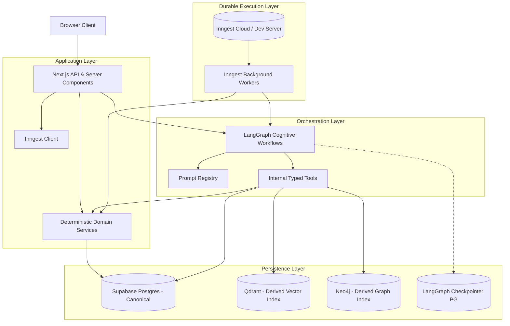
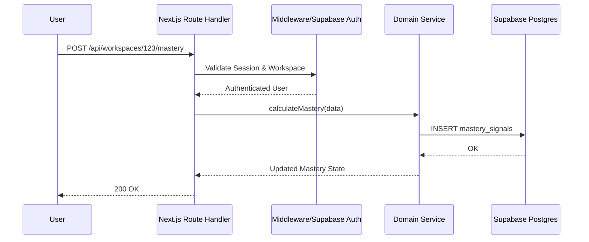
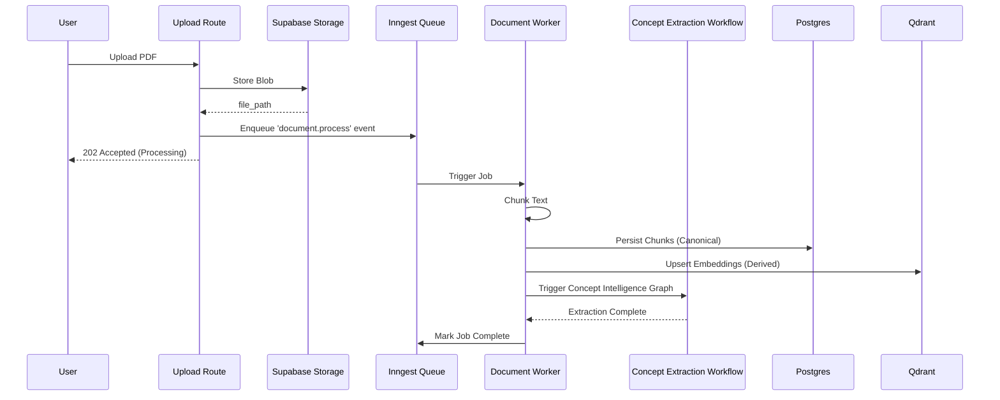
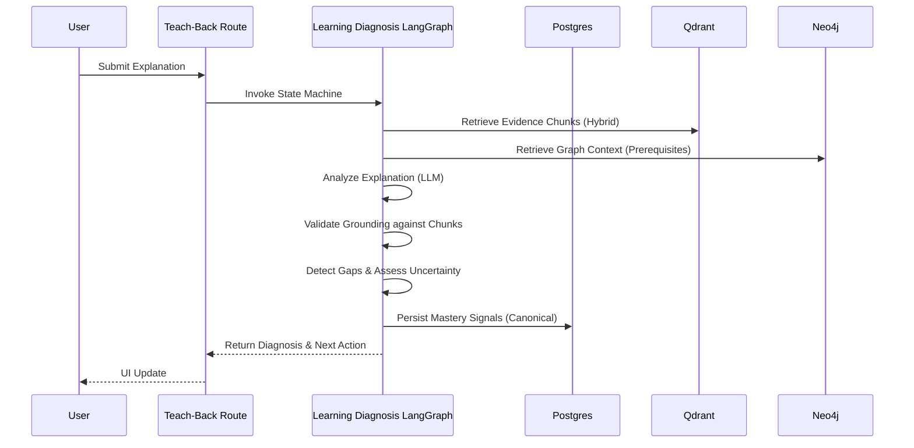
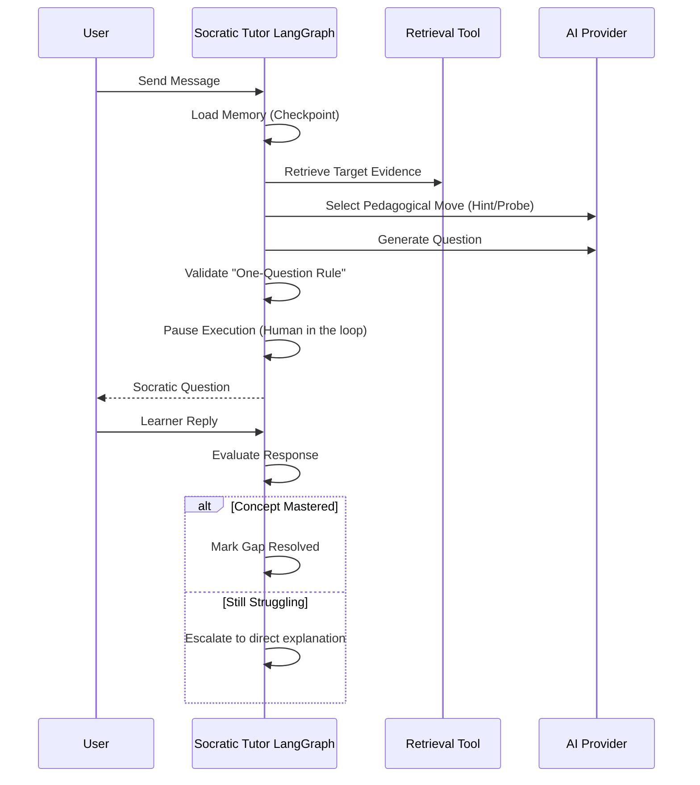
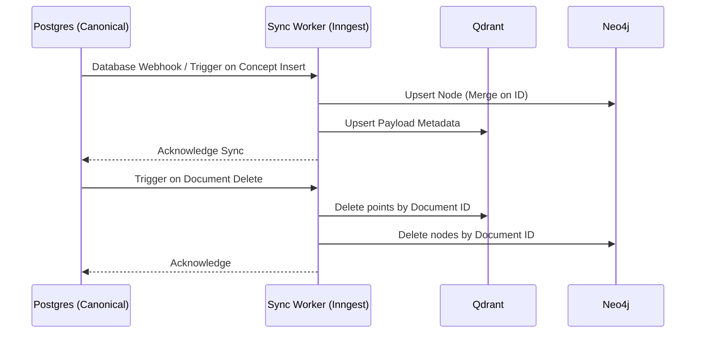
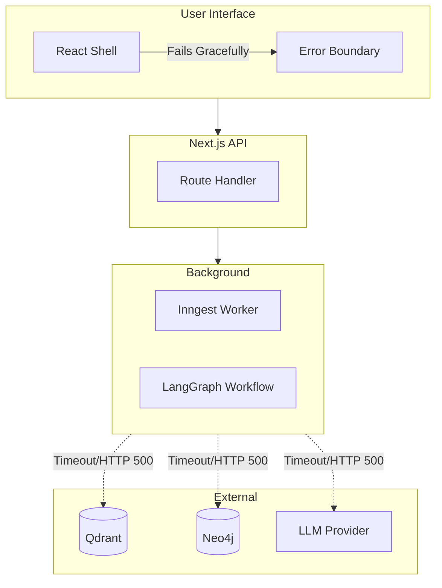

# Target Architecture

Tessarion's architecture cleanly separates presentation, stateless application logic, stateful cognitive workflows, durable background execution, and purpose-built persistence layers.

**Critical Policy - Canonical Ownership:** Supabase (Postgres) is the **absolute canonical source of truth** for all entities, including Concept IDs, Graph relationships, and learner memory. External systems (Neo4j, Qdrant) are strictly derived projections optimized for traversal and semantic retrieval. They must never be treated as the system of record.

---

## 1. System Architecture

This diagram illustrates the separation of concerns between Next.js, LangGraph, Inngest, and the persistence layers.

---

## 2. Request Lifecycle (Synchronous API)

Standard REST or Server Action flows that do not require multi-step AI reasoning.

---

## 3. Ingestion Lifecycle (Asynchronous Background)

How large source documents are processed safely without HTTP timeouts.

---

## 4. Teach-Back Diagnosis Workflow

How LangGraph evaluates a learner's explanation against the source evidence.

---

## 5. Socratic Tutoring Workflow

Stateful multi-turn human-in-the-loop workflow.

---

## 6. Data Synchronization (Postgres to Projections)

Ensures derived stores never drift from canonical reality.

---

## 7. Failure Boundaries

Visualizes isolation. If an external service falls, the blast radius is contained.

